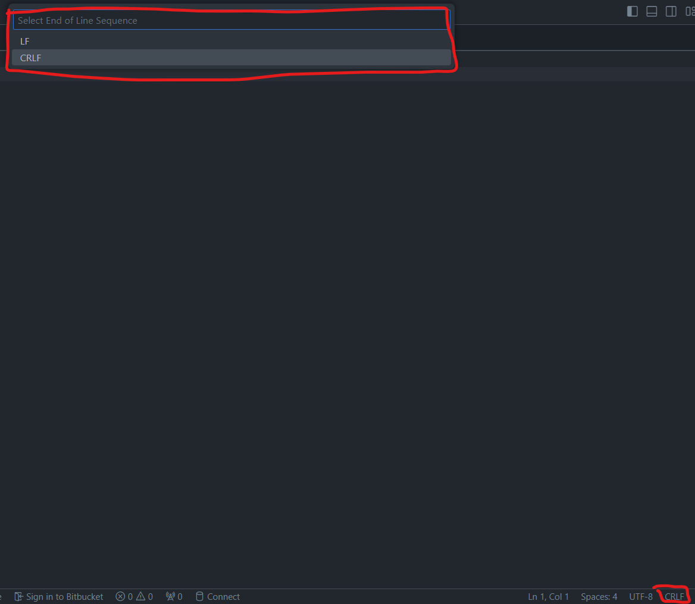

# Starbot - The Chabot Shining Light on Starlight
This repository contains the code for Starbot - an interactive chatbot ready to answer the user's questions about World Famous Landmarks!

## Demo

https://github.com/suneel-nadipalli/starlight-bot/assets/140884446/3fbfdcef-1e25-478e-91c5-657e242df108

## Overview
The project consists of two main components:

- Frontend: Built with React, providing a user interface for interacting with the chatbot.
- Backend: Developed using Flask, hosting APIs to handle user queries and manage chatbot memory.

## Features
- Conversational Format: Chat is presented in a linear conversational format
- Persistent Chat: Saves user conversations using local storage.
- Interactive Interface: Allows users to ask questions and receive responses from a language model.
- Memory Management: Includes functionality to clear chat history and reset the chatbot's memory.

## Technologies Used
- Frontend: React, Material-UI
- Backend: Flask, Flask-CORS
- Language Model: OpenAI GPT-4 via langchain library

## Installation
Prerequisites
- Python 3.11.8
- Node.js
- npm or yarn

## Backend Setup

### Clone the repository:

```bash 
git clone https://github.com/suneel-nadipalli/starlight-bot.git
cd starlight-bot

```

### Install Python dependencies:

```bash
cd api
pip install -r requirements.txt
```

### Set up environment variables:

Create a .env.local file in the ```api``` directory with the following variables:
- DEBUG=True
- OPENAI_API_KEY=your_openai_api_key

### Run the Flask server:

```bash
cd api
python app.py
```

## Frontend Setup

### Navigate to the frontend directory:

## Change EOF type from CRLF to LF in all 3 .js files, found in the ```src``` folder



```bash
cd ui
```

### Install npm packages:

```bash
npm install
```

### Start the React development server:

```bash
npm start
```

### Open your browser and go to http://localhost:3000 to view the application.
